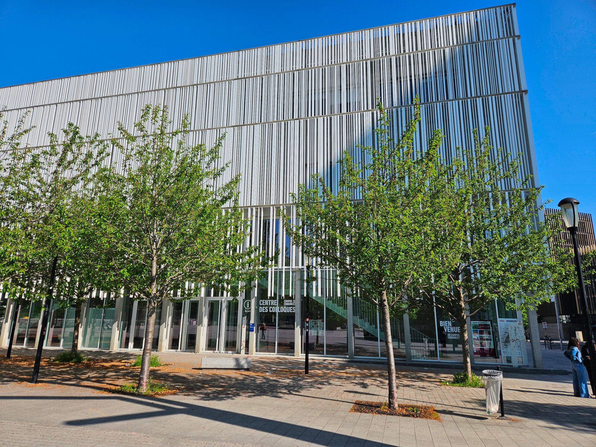
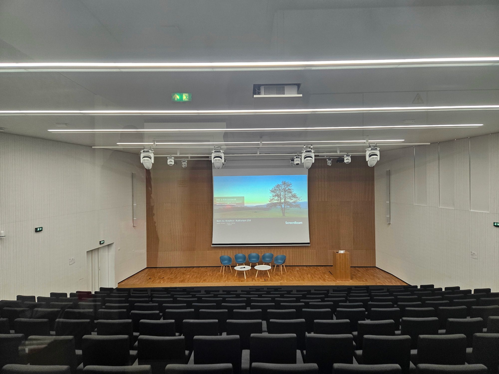
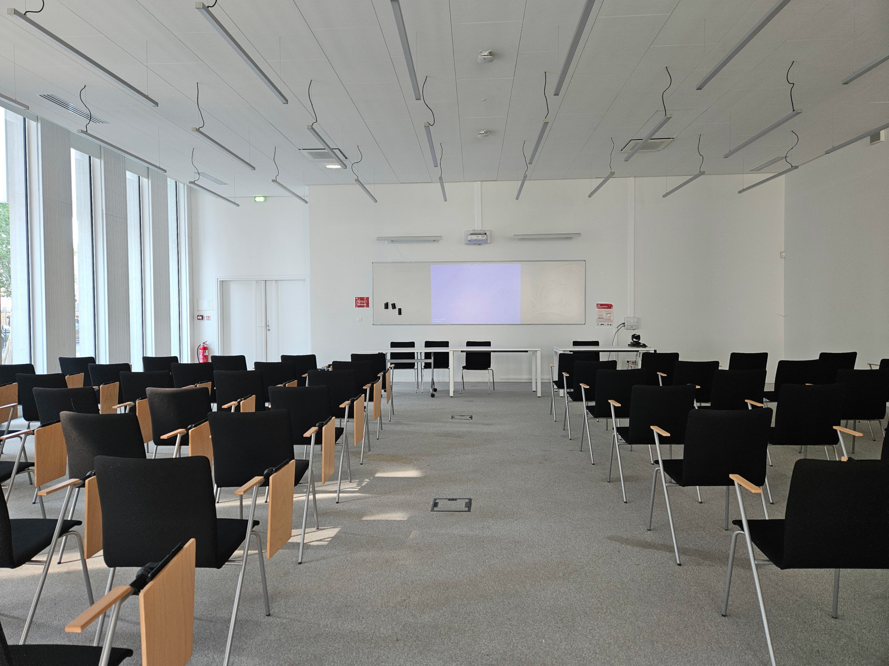
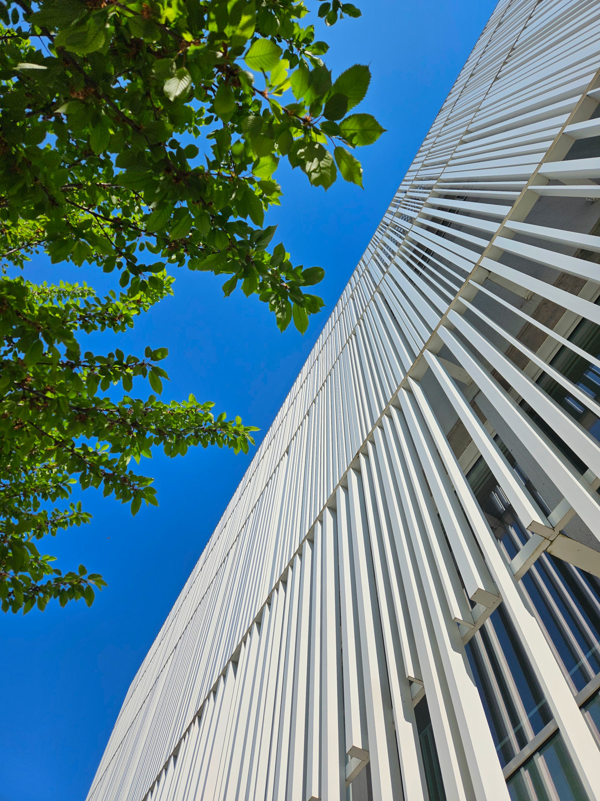

## Access

Petri Nets 2025, together with all associated events (Petri Nets course, workshops), is located at the **Centre de colloques** (conference center) of **[Campus Condorcet Paris-Aubervilliers](https://www.campus-condorcet.fr/en)**.

The **Centre de colloques** is located immediately on métro line 12 station **[Front Populaire](https://en.wikipedia.org/wiki/Front_Populaire_station)**.

<iframe width="425" height="350" src="https://www.openstreetmap.org/export/embed.html?bbox=2.362275123596192%2C48.90609545315618%2C2.3698925971984868%2C48.90821982633947&amp;layer=mapnik" style="border: 1px solid black"></iframe> <small><a href="https://www.openstreetmap.org/?#map=19/48.907158/2.366084">Display full screen map</a></small>

Exact GPS coordinates: [48.907175 / 2.366427](https://www.openstreetmap.org/node/11266990941#map=19/48.907175/2.366427).

### Public transportation
* 🚇 Paris métro: [Front Populaire](https://en.wikipedia.org/wiki/Front_Populaire_station), **exit #2 "Campus Condorcet"**, then once outside, the entrance is immediately on your left.
* 🚲 [Vélib'](https://www.velib-metropole.fr/en) (Paris self-service bicycle) station 32021 immediately near the conference center
* 🗺 [Itinerary planner Île-de-France mobilités](https://www.iledefrance-mobilites.fr/en); alternatively, CityMapper is very efficient for itinerary planning in Paris

### Address
Centre de colloques 
Campus Condorcet 
Place du Front populaire 
93322 Aubervilliers cedex

### Accommodation

Due to the variety of the accommodation in Paris (with various prices and comfort levels), we do not recommend any specific hotel.

Hotels located within central Paris along métro line 12 may be a good choice.

For budget accommodation, [UCPA Sport Station Youth Hostel](https://www.ucpa.com/hostel-paris-19/spot) might be a good option (which we have not tested though). It is located in Rosa Parks, a 10 minute bus ride or a 30 minute walk to the conference location.
