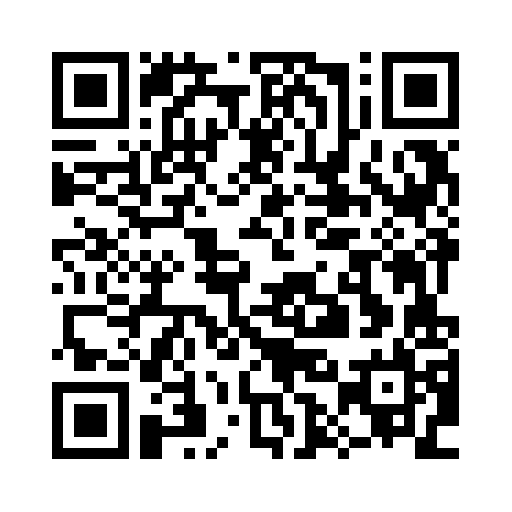

## Access

Petri Nets 2025, together with all associated events (Petri Nets course, workshops), will be held at the **Centre de colloques** (conference center) of **[Campus Condorcet Paris-Aubervilliers](https://www.campus-condorcet.fr/en)**.

The **Centre de colloques** is located immediately next to métro line 12 station **[Front Populaire](https://en.wikipedia.org/wiki/Front_Populaire_station)**.

<iframe width="425" height="350" src="https://www.openstreetmap.org/export/embed.html?bbox=2.362275123596192%2C48.90609545315618%2C2.3698925971984868%2C48.90821982633947&amp;layer=mapnik" style="border: 1px solid black"></iframe> <small><a href="https://www.openstreetmap.org/?#map=19/48.907158/2.366084">Display full screen map</a></small>

Exact GPS coordinates: [48.907175 / 2.366427](https://www.openstreetmap.org/node/11266990941#map=19/48.907175/2.366427).

### Public transportation
* 🚇 Paris métro: [Front Populaire](https://en.wikipedia.org/wiki/Front_Populaire_station), **exit #2 "Campus Condorcet"**, then once outside, the entrance is immediately on your left.
* 🚲 [Vélib'](https://www.velib-metropole.fr/en) (Paris self-service bicycle) station 32021 immediately near the conference center
* 🗺 [Itinerary planner Île-de-France mobilités](https://www.iledefrance-mobilites.fr/en); alternatively, CityMapper is very efficient for itinerary planning in Paris

*If you haven't been to Paris recently, note that, since 2025, a new ticketing system has been in use: any métro/RER/train in the entire Paris region costs the same price, around €2.50, and the same ticket can be used for transfers; buses require a separate ticket; airport access requires an extra charge, regardless of whether you use the RER (for CDG) or the métro (for Orly).*

### Address
Centre de colloques 
Campus Condorcet 
Place du Front populaire 
93322 Aubervilliers cedex

## Signal group
If you have any very last minute issues, please feel free to join our Signal group:
[signal.group](https://signal.group/#CjQKIGJi2HcFzl1wjdh_ybAoBUiYrNml02WyCuZgTmy0b-fiEhD3uoGNrD9ICh2tbrVP6TfY)

We will try to answer almost immediately to messages posted there, during the whole event.

## Accommodation

Due to the variety of the accommodation in Paris (with various prices and comfort levels), we do not recommend any specific hotel.

Hotels located within central Paris along métro line 12 may be a good choice.

For budget accommodation, [UCPA Sport Station Youth Hostel](https://www.ucpa.com/hostel-paris-19/spot) might be a good option (which we have not tested though). It is located in Rosa Parks, a 10 minute bus ride or a 30 minute walk to the conference location.

