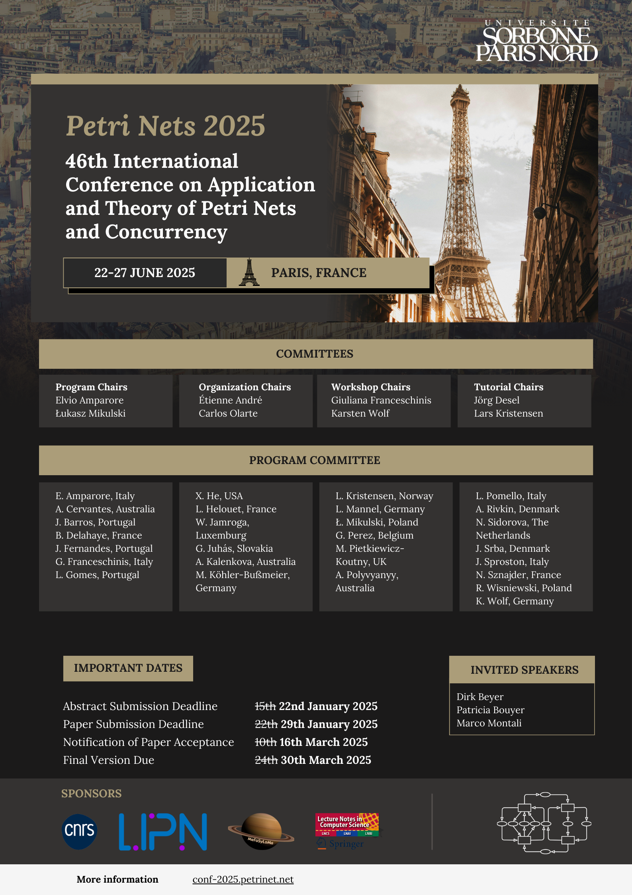

## Call for Papers

Preliminary version available [here](../files/cfp-2025.pdf).

### Format

| Paper      | Format |
| ----------- | ----------- |
| Regular papers      | 20 pages excluding references |
| Short papers      | 10 pages excluding references |

Papers must be written in English using the [Springer LNCS format](https://www.springer.com/gp/computer-science/lncs/editor-guidelines-for-springer-proceedings), including line numbers (e.g., [lineno](https://ctan.org/pkg/lineno) LaTeX package) and submitted electronically (as a PDF file).

## Poster

Download in formats: [PNG](./../poster/poster-PN25.png) / [PDF](./../poster/poster-PN25.pdf) / [PDF (high resolution)](./../poster/poster-PN25-highres.pdf)
