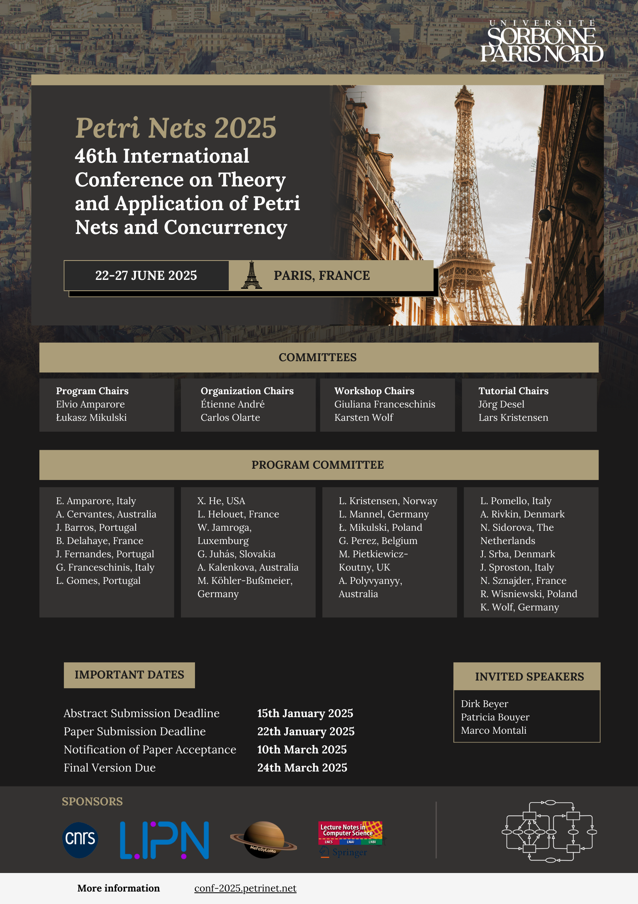

# Petri Nets 2025

## Welcome 
The 46th International Conference on Theory and Application of Petri Nets and
Concurrency conference will be organized by the [LoVe](https://lipn.univ-paris13.fr/love/) team 
from Laboratoire d'Informatique de Paris Nord ([LIPN](https://lipn.univ-paris13.fr/)),
[Université Sorbonne Paris Nord](https://www.univ-spn.fr/)
jointly
with members of the [MeFoSyLoMa](https://www.mefosyloma.fr) group. 

The conference will take place at the [Campus Condorcet](https://www.campus-condorcet.fr/en),
Paris-Aubervilliers, France ([métro line 12](https://en.wikipedia.org/wiki/Front_Populaire_station)). 

_Photo by [Anthony DELANOIX](https://unsplash.com/photos/eiffel-tower-at-paris-france-QAwciFlS1g4?utm_content=creditShareLink&utm_medium=referral&utm_source=unsplash){:target="_blank"}_

## Topics specific to Petri Nets
* Analysis and synthesis, structure and behaviour of nets
* System design and model-driven development using nets
* Relationships between Petri nets and other approaches
* Net-based semantical, logical and algebraic calculi
* Higher-level net models (e.g, coloured nets, timed nets)
* Stochastic net models
* Verification and model checking using nets
* Process discovery and conformance checking
* Computer tools for nets
* Standardisation of nets
* Experience reports describing applications of nets to different kinds of systems and application fields, e.g.:
    * flexible manufacturing systems
    * office automation
    * real-time systems
    * workflows
    * embedded systems
    * process mining
    * biological systems
    * supervisory control
    * health and medical systems
    * railway networks
    * Internet and Web services
    * environmental systems
    * e-commerce and trading
    * hardware
    * programming languages
    * telecommunications
    * protocols and networks
    * performance evaluation
    * component based development
    * operations research

## General topics of interest related to concurrency
* Application of concurrency to system design:
    * formal models (e.g., dataflow models, communicating automata, process algebras, modal and temporal logics) for designing computer systems with concurrent behaviour
    * applied research aimed at designing computer systems which exhibit concurrency
* Model checking and verification of distributed systems
* Verification of infinite-state or parametric systems
* Causality/partial order theory of concurrency
* Educational issues related to concurrency
* New developments in the theory of concurrency
* Modelling of hardware and biological systems

## Poster

Download in formats: [PNG](./poster/poster-PN25.png) / [PDF](./poster/poster-PN25.pdf) / [PDF (high resolution)](./poster/poster-PN25-highres.pdf)

## Sponsors

    
    
    
    

