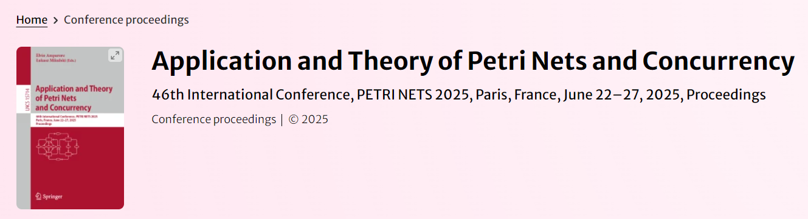

# Program

## Proceedings

The proceedings of the Petri Nets main conference can be accessed via the Springer Web site below:

## Day-by-day program

### Until Monday 23rd June 2025: Petri net course
* video lecture by Jörg Desel: **[Basic Net Classes](https://www.fernuni-hagen.de/pnc/pnc2025/)**
* video lecture by Lars Michael Kristensen: **[Coloured Petri Nets and the CPN Tools ](https://www.fernuni-hagen.de/pnc/pnc2025/)**

### Monday 23rd June 2025: workshops and Petri net course

| Event      | Schedule | Location |
| ----------- | ----------- | ----------- |
| [Petri Net Course](https://www.fernuni-hagen.de/pnc/pnc2025/): Verification and Model Checking of Petri Nets | 8.30 – 10.00 and 10.30 – 12.00 | Room 3.01 |
| [Petri Net Course](https://www.fernuni-hagen.de/pnc/pnc2025/): Timed and Stochastic Petri Nets | 13.30 – 15.00 and 15.30 – 17.00 | Room 3.01 |
| [PNSE 2025](https://www.informatik.uni-hamburg.de/TGI/events/pnse/pnse25/) | 8.30 – 10.00 and 10.30 – 12.00 and 13.30 – 15.00 and 15.30 – 17.00 | Salle 100 |
| 17:00-… | 🍸PNSE posters and cocktail *(open to everyone)* | Forum |

### Tuesday 24th June 2025: workshops and tutorials

| Event      | Schedule | Location |
| ----------- | ----------- | ----------- |
| [Tutorial](https://www.fernuni-hagen.de/pnc/pnc2025/): Object-centric process modeling and analysis. A short avant-garde journey | 8.30 – 10.00 and 10.30 – 12.00 | Salle 100 |
| [Tutorial](https://www.fernuni-hagen.de/pnc/pnc2025/): Modeling Complex Systems with High-level Petri Nets | 13.30 – 15.00 and 15.30 – 17.00  | Salle 100 |
| [ATAED 2025](https://www.fernuni-hagen.de/ataed/ataed2025/) | 13:45 - 15:00 and 15:30 - 17:00 | Room 3.02 |
| [Model Checking Contest 2025](https://mcc.lip6.fr/) | 13.30 – 15.00 | Room 3.01 |
| [PeNGE 2025](https://www.fernuni-hagen.de/penge/penge2025/) | 09.00 – 10.00 and 10.30 – 12.00| Room 3.01 |
| Steering committee meeting *(by invitation)* | 16.00 – 17.30 | Room 3.01 |
| Steering committee dinner *(by invitation)* | 19.00 – … | Rue d'Odessa, 75014 Paris |

### Wednesday 25th June 2025: main conference

| Time | Session      | Authors | Paper |
| ----------- | ----------- | ----------- | ----------- |
| 08:15-8:45 | 📑Registration | | |
| **08:45-09:00** | 🗣Opening | Elvio Amparore and Łukasz Mikulski | |
| **09:00-10:00** | **Invited speaker** | **Dirk Beyer**  (Chair: Étienne André) | **The Transformation Game: Joining Forces for Verification** |
| 10:00-10:30 | ☕️_Coffee break_ | | |
| **10:30-12:00** | **Session 1: Composition & Synthesis** | Chair: Lucia Pomello | |
| 10:30-11:00 | | <a href="https://www.haw-hamburg.de/michael-koehler-bussmeier">Michael Köhler-Bußmeier</a> and Lorenzo Capra   | Analysing Probabilistic Hornets |
| 11:00-11:30 | | <a href="http://www.cs.ncl.ac.uk/people/maciej.koutny">Maciej Koutny</a>, <a href="http://www.staff.ncl.ac.uk/alex.yakovlev">Alex Yakovlev</a> and <a href="https://www.ncl.ac.uk/computing/staff/profile/victorkhomenko.html">Victor Khomenko</a>  | Distributed Places and Safe Net Reduction |
| 11:30-12:00 | | <a href="https://www.fernuni-hagen.de/mi/fakultaet/lehrende/bergenthum/index.shtml">Robin Bergenthum</a> and <a href="https://www.fernuni-hagen.de/ps/team/Jakub.Kovar.shtml">Jakub Kovář</a>  | Synthesizing Petri Nets from Labelled Petri Nets |
| 12:00-13:30 | 🥗_Lunch break_ | | |
| **13:30-15:00** | **Session 2: Workflow Nets** | Chair: Loïc Hélouët | |
| 13:30-14:00 | | <a href="https://www.ule.uni-jena.de/studiengangsevaluation/software">Thomas M. Prinz</a>, Christopher T. Schwanen and <a href="http://www.vdaalst.com">Wil van der Aalst</a>  | Deciding (Sub-Marking) Reachability in O(P2 + T2) for Sound Acyclic Free-Choice Workflow Nets |
| 14:00-14:30 | | Christopher T. Schwanen, <a href="https://hsbund.de">Wied Pakusa</a> and <a href="http://www.vdaalst.com">Wil van der Aalst</a>  | Complexity of Alignments on Sound Free-Choice Workflow Nets |
| 14:30-15:00 | | Humam Kourani, Gyunam Park and Wil van der Aalst   | Translating Workflow Nets into the Partially Ordered Workflow Language |
| 15:00-15:30 | ☕️_Coffee break_ | | |
| 15:30-17:30 | **Session 3: Process Mining** | Chair: Michael Köhler-Bußmeier ||
| 15:30-16:00 | | <a href="http://adambanham.io">Adam Banham</a>, Yannis Bertrand, Robert Andrews, <a href="http://staff.qut.edu.au/staff/m.wynn">Moe Wynn</a> and <a href="http://leemans.ch">Sander J.J. Leemans</a>   | Discovering the Influence of Exogenous Data on Decisions in Processes |
| 16:00-16:30 | | Priyanka Kamboj, Cyrille Artho, Roberto Guanciale, Reyhaneh Jabbarvand and Brighten Godfrey  | Leveraging Petri Nets for Workflow Anomaly Detection in Microservice Architectures |
| 16:30-17:00 | | Ariba Siddiqui, <a href="http://www.vdaalst.com">Wil van der Aalst</a> and Daniel Schuster   | Computing Alignments for Partially-ordered Traces Through Petri Net Unfoldings |
| 17:00-17:30 | | <a href="http://leemans.ch">Sander J.J. Leemans</a>, <a href="http://www.inf.unibz.it/~montali/">Marco Montali</a>, Timo Gersing, Felix Engelhardt and <a href="http://www.win.tue.nl/~sidorova/">Natalia Sidorova</a>  | Enjoy the Silence, Part II: Probability-Based Queries on Stochastic Labelled Petri Nets |
| 18:30-20:00 | 🍸_Welcome reception_ | | |

### Thursday 26th June 2025: main conference

| Time | Session      | Authors | Paper |
| ----------- | ----------- | ----------- | ----------- |
| **09:00-10:00** | **Invited speaker** | **Patricia Bouyer-Decitre** (Chair: Elvio Amparore) | **On the Probabilistic and Statistical Verification of Infinite Markov Chains** |
| 10:00-10:30 | ☕️_Coffee break_ | | |
| **10:30-12:00** | **Session 4: Model Checking** | Chair: Abel Armas | |
| 10:30-11:00 | |  Lukas Zech.  | Symbolic Model Checking in the Modular State Space using Binary Decision Diagrams |
| 11:00-11:30 | |  Yann Thierry-Mieg, <a href="http://www.lrde.epita.fr/~adl">Alexandre Duret-Lutz</a> and <a href="http://lip6.fr/Denis.Poitrenaud">Denis Poitrenaud</a>   | Simplifying LTL Model-Checking Given Prior Knowledge |
| 11:30-12:00 | | <a href="https://www.linkedin.com/in/baptiste-pelletier-357b87166">Baptiste Pelletier</a>, Charles Lesire and Karen Godary-Dejean  | SkiNet: a User-Oriented Tool for Petri Net-based Analysis of Robotic Skills |
| 12:00-13:30 | 🥗_Lunch break (vegetarian)_ | | |
| **13:30-15:00** | **Session 5: Timed and Stochastic Petri nets** | Chair: Andrey Rivkin | |
| 13:30-14:00 | | Tanguy Dubois, Kim Guldstrand Larsen and <a href="http://www.cs.aau.dk/~srba">Jiri Srba</a>  | Statistical Model Checking of Stochastic Timed-Arc Petri Nets |
| 14:00-14:30 | | <a href="http://pagesperso.ls2n.fr/~lime-d/">Didier Lime</a>, <a href="http://remiparrot.github.io">Rémi Parrot</a> and <a href="http://pagesperso.ls2n.fr/~roux-o/">Olivier H. Roux</a>  | Decidability problems for weak Time Petri Nets with read, reset and transfer arcs |
| 14:30-15:00 | | <a href="http://people.rennes.inria.fr/Loic.Helouet/">Loic Helouet</a>, <a href="http://people.irisa.fr/Nicolas.Markey/">Nicolas Markey</a> and Luca Paparazzo  | Energy Transfer in timed cyclic networks |
| 15:00-16:00 | ☕️_Coffee break and tool demos_ | | |
| **15:00-16:00** | **Tool demonstrations** | Chair: Dylan Marinho | |
| | | Sander Leemans | [Ebi - a stochastic process mining tool](https://bpm.rwth-aachen.de/ebi/)  |
| | | Jakub Kovar  | [I ❤ Petri Nets](https://www.fernuni-hagen.de/ilovepetrinets/) (website) |
| | | TBA | TBA |
| **16:00-17:30** | **Session 6: Communication & concurrency** | Chair: Lars Michael Kristensen | |
| 16:00-16:30 | | <a href="https://www.benedikt-bollig.org">Benedikt Bollig</a>, <a href="https://www.irif.fr/users/mfortin/">Marie Fortin</a> and <a href="http://www.lsv.fr/~gastin/">Paul Gastin</a>  | High-Level Message Sequence Charts: Satisfiability and Realizability Revisited |
| 16:30-17:00 | | Amazigh Amrane, Hugo Bazille, <a href="https://www.lrde.epita.fr/~uli/">Uli Fahrenberg</a>, Loïc Hélouët and Philipp Schlehuber-Caissier  | Petri Nets and Higher-Dimensional Automata |
| 17:00-17:30 | | Laif-Oke Clasen, Can Nayci and <a href="http://www.informatik.uni-hamburg.de/TGI/moldt/">Daniel Moldt</a>  | Distributed Reference Net Simulation based on Event Streaming |
| **19:00-23:00** | 🍽_Conference dinner_ | Paris 14th district | |

### Friday 27th June 2025: main conference

| Time | Session      | Authors | Paper |
| ----------- | ----------- | ----------- | ----------- |
| **09:00-10:00** | **Invited speaker** | **Marco Montali** (Chair: Łukasz Mikulski) | **Automated Reasoning for Data-Aware Petri Nets** |
| 10:00-10:30 | ☕️_Coffee break_ | | |
| **10:30-12:00** | **Session 7: Theory of Petri nets** | Chair: Marta Pietkiewicz-Koutny | |
| 10:30-11:00 | | <a href="http://www.informatik.uni-hamburg.de/TGI/mitarbeiter/profs/valk.html">Rüdiger Valk</a>.  | Failure Resilience of strongly synchronized Processes |
| 11:00-11:30 | | <a href="https://uol.de/parsys/kontakte/best">Eike Best</a> and Raymond Devillers   | Persistent Permutations, Fairness, Asymmetric Choice Petri Nets, and Ochmanski's Conjecture |
| 11:30-12:00 | | <a href="https://uol.de/parsys/kontakte/best">Eike Best</a> , Raymond Devillers and Petr Jancar  | Coverability in Well-Formed Free-Choice Nets |
| 12:00-12:30 | | | **Closing session** |

## List of all accepted papers (in no particular order)

* <a href="http://leemans.ch">Sander J.J. Leemans</a>, <a href="http://www.inf.unibz.it/~montali/">Marco Montali</a>, Timo Gersing, Felix Engelhardt and <a href="http://www.win.tue.nl/~sidorova/">Natalia Sidorova</a>.  **Probability-Based Queries on Stochastic Labelled Petri Nets**
* <a href="https://uol.de/parsys/kontakte/best">Eike Best</a> and Raymond Devillers .  **Persistent Permutations, Fairness, Asymmetric Choice Petri Nets, and Ochmanski's Conjecture**
* <a href="https://uol.de/parsys/kontakte/best">Eike Best</a> , Raymond Devillers and Petr Jancar.  **Coverability in Well-Formed Free-Choice Nets**
* <a href="http://adambanham.io">Adam Banham</a>, Yannis Bertrand, Robert Andrews, <a href="http://staff.qut.edu.au/staff/m.wynn">Moe Wynn</a> and <a href="http://leemans.ch">Sander J.J. Leemans</a>.  **Discovering the Influence of Exogenous Data on Decisions in Processes**
* <a href="http://www.cs.ncl.ac.uk/people/maciej.koutny">Maciej Koutny</a>, <a href="http://www.staff.ncl.ac.uk/alex.yakovlev">Alex Yakovlev</a> and <a href="https://www.ncl.ac.uk/computing/staff/profile/victorkhomenko.html">Victor Khomenko</a>.  **Distributed Places and Safe Net Reduction**
* <a href="https://www.haw-hamburg.de/michael-koehler-bussmeier">Michael Köhler-Bußmeier</a> and Lorenzo Capra.  **Analysing Probabilistic Hornets**
* <a href="https://www.ule.uni-jena.de/studiengangsevaluation/software">Thomas M. Prinz</a>, Christopher T. Schwanen and <a href="http://www.vdaalst.com">Wil van der Aalst</a>.  **Deciding (Sub-Marking) Reachability in O(P2 + T2) for Sound Acyclic Free-Choice Workflow Nets**
* Priyanka Kamboj, Cyrille Artho, Roberto Guanciale, Reyhaneh Jabbarvand and Brighten Godfrey.  **Leveraging Petri Nets for Workflow Anomaly Detection in Microservice Architectures**
* Lukas Zech.  **Symbolic Model Checking in the Modular State Space using Binary Decision Diagrams**
* <a href="https://www.fernuni-hagen.de/mi/fakultaet/lehrende/bergenthum/index.shtml">Robin Bergenthum</a> and <a href="https://www.fernuni-hagen.de/ps/team/Jakub.Kovar.shtml">Jakub Kovář</a>.  **Synthesizing Petri Nets from Labelled Petri Nets**
* Tanguy Dubois, Kim Guldstrand Larsen and <a href="http://www.cs.aau.dk/~srba">Jiri Srba</a>.  **Statistical Model Checking of Stochastic Timed-Arc Petri Nets**
* Yann Thierry-Mieg, <a href="http://www.lrde.epita.fr/~adl">Alexandre Duret-Lutz</a> and <a href="http://lip6.fr/Denis.Poitrenaud">Denis Poitrenaud</a>.  **Simplifying LTL Model-Checking Given Prior Knowledge**
* Humam Kourani, Gyunam Park and Wil van der Aalst.  **Translating Workflow Nets into the Partially Ordered Workflow Language**
* <a href="http://pagesperso.ls2n.fr/~lime-d/">Didier Lime</a>, <a href="http://remiparrot.github.io">Rémi Parrot</a> and <a href="http://pagesperso.ls2n.fr/~roux-o/">Olivier H. Roux</a>.  **Decidability problems for weak Time Petri Nets with read, reset and transfer arcs**
* <a href="https://www.linkedin.com/in/baptiste-pelletier-357b87166">Baptiste Pelletier</a>, Charles Lesire and Karen Godary-Dejean.  **SkiNet: a User-Oriented Tool for Petri Net-based Analysis of Robotic Skills**
* <a href="http://people.rennes.inria.fr/Loic.Helouet/">Loic Helouet</a>, <a href="http://people.irisa.fr/Nicolas.Markey/">Nicolas Markey</a> and Luca Paparazzo.  **Energy Transfer in timed cyclic networks**
* Ariba Siddiqui, <a href="http://www.vdaalst.com">Wil van der Aalst</a> and Daniel Schuster.  **Computing Alignments for Partially-ordered Traces Through Petri Net Unfoldings**
* Christopher T. Schwanen, <a href="https://hsbund.de">Wied Pakusa</a> and <a href="http://www.vdaalst.com">Wil van der Aalst</a>.  **Complexity of Alignments on Sound Free-Choice Workflow Nets**
* Amazigh Amrane, Hugo Bazille, <a href="https://www.lrde.epita.fr/~uli/">Uli Fahrenberg</a>, Loïc Hélouët and Philipp Schlehuber-Caissier.  **Petri Nets and Higher-Dimensional Automata**
* <a href="http://www.informatik.uni-hamburg.de/TGI/mitarbeiter/profs/valk.html">Rüdiger Valk</a>.  **Failure Resilience of strongly synchronized Processes**
* <a href="https://www.benedikt-bollig.org">Benedikt Bollig</a>, <a href="https://www.irif.fr/users/mfortin/">Marie Fortin</a> and <a href="http://www.lsv.fr/~gastin/">Paul Gastin</a>.  **High-Level Message Sequence Charts: Satisfiability and Realizability Revisited**
* Laif-Oke Clasen, Can Nayci and <a href="http://www.informatik.uni-hamburg.de/TGI/moldt/">Daniel Moldt</a>.  **Distributed Reference Net Simulation based on Event Streaming**

