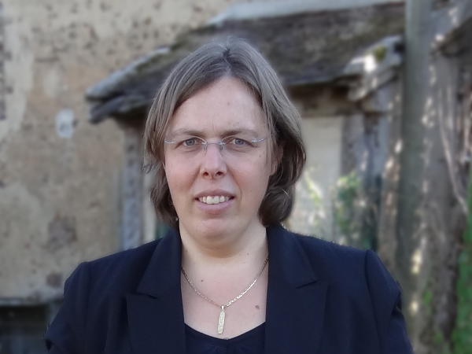

## [Dirk Beyer](https://www.sosy-lab.org/people/beyer/)

Full Professor, Head of Research Chair (Lehrstuhlinhaber), Software and Computational Systems Lab, Department of Computer Science, Ludwig-Maximilians-Universität München (LMU Munich), Germany

### The Transformation Game: Joining Forces for Verification

The presentation consists of two parts.
The first part makes a case for transformation as a key verification technology.
Transformations are used to convey information across different abstraction layers
and to underpin the correctness, efficiency, and usability of formal-methods tools.
The lack of modularity incurs repeated engineering effort and the risk
of bugs in the process of ‘reinventing the wheel’.
It can be seen as a new paradigm to construct verification technology
by employing standardized formats and interfaces for information exchange,
and by building modular transformers between verification artifacts.
Our vision is an ecosystem of reusable verification components that
supports joining forces of all available techniques, allows agile development
of new tools, and provides a common ground to evaluate and
compare future scientific advancements: via modular transformation.

In a second part, to support the transformation approach,
we describe an approach to collect and conserve tools for formal methods.
We collect and maintain essential data about tools for formal methods in
a central repository, called FM-Tools, available at
[https://fm-tools.sosy-lab.org](https://fm-tools.sosy-lab.org).
The repository contains metadata, such as which tools are
available, which versions are advertized for each tool,
and what command-line arguments to use for default usage.
The actual tool executables are stored in tool archives at Zenodo,
and for technically deep documentation, references point
to archived publications on project web sites.
With this approach, we can conserve today's tools for the future.

Supporting Material:
 * Part 1: [The Transformation Game: Joining Forces for Verification](https://doi.org/10.1007/978-3-031-75778-5_9)
 * Part 2: [Find, Use, and Conserve Tools for Formal Methods](https://www.sosy-lab.org/research/pub/2024-Podelski65.Find_Use_and_Conserve_Tools_for_Formal_Methods.pdf)

### Short biography

_Dirk Beyer is Full Professor of Computer Science and has a Research Chair
for Software and Computational-Systems Engineering at LMU Munich, Germany (since 2016).
Before, he was Full Professor of Computer Science at University of Passau, Germany (2009-2016).
He was Assistant and Associate Professor at Simon Fraser University, B.C., Canada (2006-2009),
and Postdoctoral Researcher at EPFL in Lausanne, Switzerland (2004-2006) and
at the University of California, Berkeley, USA (2003-2004), in the group of Tom Henzinger.
Dirk Beyer holds a Dipl.-Inf. degree (1998) and a Dr. rer. nat. degree (2002)
in Computer Science from the Brandenburg University of Technology in Cottbus, Germany.
In 1998 he was Software Engineer with Siemens AG, SBS Dept. Major Projects in Dresden, Germany.
His research focuses on models, algorithms, and tools for the construction and analysis of reliable software systems.
He is architect, designer, and implementor of several successful tools.
For example, CrocoPat is the first efficient interpreter for relational programming,
BenchExec is a framework for reliable benchmarking, and
CPAchecker and BLAST are two well-known and successful software model checkers._

## [Patricia Bouyer](https://lmf.cnrs.fr/PatriciaBouyer/)

Senior Researcher, CNRS, Director of LMF, ENS Paris-Saclay, France

### On the Probabilistic and Statistical Verification of Infinite Markov Chains

The verification of infinite-state Markov chains is a challenging problem, even
when those chains are described by structured high-level models. In 2007,
Abdulla et al. introduced the concept of decisiveness (Log. Meth. Comput.
Sci.), and showed that a natural approximation scheme could be applied to
infinite Markov chains that are decisive. This was, up to our knowledge, the
unique generic scheme that could be widely applied to (decisive) infinite
Markov chains providing guarantees on the computed values (under some mild
assumptions for effectiveness). On the other hand, statistical model-checking
is a very efficient method that can be used for estimating probabilities in
stochastic systems (Younes et al., SBMF’10, Inf. Comput. 2006). We explain in
this talk that decisiveness is also a key concept that allows to apply such
statistical methods to infinite Markov chains.

While decisiveness is a crucial property, not all Markov chains are decisive,
and it is therefore desirable to propose methods to analyze non-decisive Markov
chains. Importance sampling (Kahn and Harris, Natl. Bureau Stands. 1951) is a
method which has been proposed to improve efficiency of statistical
model-checking, in particular for estimating probabilities of rare events in
stochastic systems. The idea is to biase the original chain, and to estimate
the probabilities in the biased chain; guarantees can sometimes be given, as
studied for instance in (Barbot, Haddad, and Picaronny, TACAS’12).

In this talk, we will explain how we use the importance sampling idea to turn a
non-decisive Markov chain into a biased decisive Markov chain, in which we can
estimate probabilities (with guarantees). We apply the general approach to a
class of probabilistic pushdown automata. Our algorithms have been implemented
in the tool Cosmos (Ballarini et al., Perf. Eval. 2015), and we discuss the
methodology for experiments as well as our (partial) conclusions.

### Short biography

_Patricia Bouyer holds a PhD in Computer Science from ENS Cachan (2002). She has
been a CNRS researcher from 2002 to 2020 at "Laboratoire Spécification et
Vérification" (LSV, CNRS & ENS Cachan, France). She is now the head of the
"Laboratoire Méthodes Formelles" (LMF, Université Paris-Saclay, CNRS, ENS
Paris-Saclay, France). She has held visiting positions at Aalborg University
(Denmark) in 2002 and Oxford University (UK) in 2007. Patricia Bouyer's main
research topics are model checking, game theory, and quantitative aspects of
verification. She has been the principal investigator of ERC Starting Grant
project EQualIS (2013-2019). She was the recipient of a Marie Curie fellowship
in 2006, of the Bronze medal of CNRS in 2007 and of the Presburger Award given
by the EATCS in 2011._

## [Marco Montali](https://www.unibz.it/en/faculties/engineering/academic-staff/person/31326-marco-montali)

Full Professor in Computer Engineering, Free University of Bozen-Bolzano, Italy

### Automated Reasoning for Data-Aware Petri Nets

The focus on work processes in process science is increasingly shifting from a case-centric, pure control-flow perspective, to a
data-aware setting where (possibly multiple interrelated) objects and
their properties are updated by and influence the process. Data may
range from simple attributes (such as strings or numbers) to complex
data structures like relational databases. Modelling, analysis, and mining of such data-aware processes call for formalisms and techniques that
simultaneously tackle time/dynamics and the interplay with these different forms of data. In this short paper, we focus on data-aware work
processes whose underlying control-flow backbone is described as a Petri
net. We overview the main modelling requirements and constructs emerging in different proposals, ranging from case- to object-centric processes.
We then summarize how artificial intelligence techniques from automated
reasoning have been employed and further developed to obtain foundational and practical results in data-aware process analysis and mining.

### Short biography

_Marco Montali is a Full Professor in Computer Engineering in the Faculty of
Engineering at the Free University of Bozen-Bolzano, Italy, where he also
coordinates the BSc Program in Informatics and Management of Digital Business.
His research is in artificial intelligence and information systems for the
modelling, analysis, and mining of processes and agents. The Leitmotiv is the
combination of model-driven and data-driven techniques to engineer trustworthy
and reliable information systems and agents, focusing on their dynamics over
time. He has served as PC Chair of BPM 2018, RuleML+RR 2019, ICPM 2020, and CBI
2021, as General Chair of ICPM 2022 and EDOC 2022, and was for 3 years steering
committee member of the IEEE task force on process mining. He is co-author of
more than 250 papers, many of which in top-notch conferences (AAAI, IJCAI,
ECAI, PODS, BPM, CAiSE, ICPM) and journals (IS, TKDE, JAIR, TOSEM), and
recipient of 10 best paper awards and 2 test-of-time awards. He received the
2015 “Marco Somalvico” award, given by the Italian Association of Artificial
Intelligence to the best under 35 Italian researcher in artificial
intelligence. He regularly meets the general public, industries, and students
to discuss about artificial intelligence and its societal implications._

 
